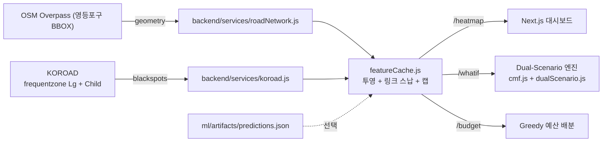

# CrashZero Architecture

## Stacks

- **Frontend**: Next.js 14 (App Router) + TailwindCSS + MapLibre GL JS.
- **Backend**: Node 20 + Express + undici + proj4 (ESM).
- **ML**: Python 3.11 + NumPy + pandas + matplotlib (pure NumPy models).

## Layout

```
crashzero/
├── frontend/   # 공공 대시보드 + What-if + Budget
├── backend/    # /heatmap /whatif /budget /cmf-catalog
├── ml/         # 5-step training pipeline
└── docs/       # 이 폴더
```

## Data flow



## Dual scenario (핵심 개념)

| | Scenario A | Scenario B |
| - | --- | --- |
| 출처 | 데이터 주도 | 정책 주도 |
| 구현 | 학습된 모델 재예측 | HSM/FHWA CMF 곡셈 |
| 장점 | 상호작용 포착 | 항상 사용 가능 · 설명 쉬움 |
| 한계 | 백엔드 모델 필요 | 상호작용 무시 |

단일 각 각은 결과 하나만 내보내지만, **둘을 같이 보여주는 게 핵심**이에요.
감소율이 조용 일치 → 확신한 투자, 차이 크면 → 검토 재검수가 필요하다는 시그널로 쓰세요.

## Spatial contract

- Unit of analysis: ITS LinkID (영등포구 명목 3,500–4,500).
- Storage CRS: EPSG:5179, display CRS: EPSG:4326.
- Accident → link: ST_DWithin 20 m.
- Facility → link: ±15 m.
- POI buffer: 100 m / 300 m / 500 m.
- Target: `(link_id, year, season, peak_offpeak)` with binary `accident`.
- Splits: train 2021–2023, val 2024, holdout 2025.
